<picture>
  <source media="(max-width: 680px)" srcset="assets/hero-mobile.svg" />
  
</picture>

<br />

## 01 // PROFILE

System Engineer working across full-stack web development, AI-assisted engineering, and automation — based in Tokyo, Japan. Focused on building reliable, well-structured applications and increasingly integrating AI-assisted workflows into day-to-day engineering.

## 02 // CURRENT SYSTEM

```txt
[+] Advanced Next.js architecture and rendering patterns
[+] System design fundamentals
[+] Clean architecture and maintainable backend structure
[+] AI-assisted engineering workflows
```

## 03 // ENGINEERING STACK

**Frontend**


**Backend**


**Data**


**Infrastructure**


**AI**


<sub>LLM-based tooling integrated across the development lifecycle — scaffolding, debugging, code review, and documentation.</sub>

## 04 // DEPLOYED PROJECTS

```txt
┌ PROJECT_01 ──────────────────────────────────────────────
│ NAME    Engineer Match
│ TYPE    Matching Platform
│ STACK   Next.js · TypeScript · Tailwind CSS · Supabase
└─────────────────────────────────────────────────────────
```

```txt
┌ PROJECT_02 ──────────────────────────────────────────────
│ NAME    Healthcare Support
│ TYPE    Medical Matching Web Application
│ STACK   Next.js · TypeScript · PAY.JP
└─────────────────────────────────────────────────────────
```

```txt
┌ PROJECT_03 ──────────────────────────────────────────────
│ NAME    Smart Planner
│ TYPE    Productivity & Task Management
│ STACK   Next.js · React · TypeScript
└─────────────────────────────────────────────────────────
```

```txt
┌ PROJECT_04 ──────────────────────────────────────────────
│ NAME    KintaiPro
│ TYPE    Attendance & Payroll Management System
│ STACK   Next.js · Supabase · PostgreSQL
└─────────────────────────────────────────────────────────
```

## 05 // GITHUB TELEMETRY

<div align="center">
  
  
</div>

<div align="center">
  
</div>

<div align="center">
  
</div>

<sub>Contribution trail generated by the <code>.github/workflows/snake.yml</code> action on this repository (Platane/snk) — it populates the <code>output</code> branch after the workflow first runs.</sub>

## 06 // CONNECTION

```txt
$ connect --github    https://github.com/shakib-24
$ connect --upwork    coming soon
```

<div align="center">
  
</div>

<p align="center"><sub>// END OF TRANSMISSION</sub></p>
