<!-- Generated by GitHub Profile Agent Console. Edit profile.config.json, then run npm run generate. -->

  <picture>
    <source media="(prefers-color-scheme: dark)" srcset="./assets/hero/agent-console-2b0d3085-dark.svg">
    <source media="(prefers-color-scheme: light)" srcset="./assets/hero/agent-console-2b0d3085-light.svg">
    
  </picture>

  

## About Me

System Engineer based in Tokyo, Japan, working across full-stack web development, AI-assisted engineering, and automation.

I focus on building reliable, well-structured applications and increasingly integrating AI-assisted workflows into day-to-day engineering.

## Current Focus

| Area | What I am exploring |
| --- | --- |
| **Frontend** | Building clean, responsive interfaces with Next.js, React, and TypeScript. |
| **Backend** | Reliable APIs and systems in Python (Django) and Java. |
| **Automation** | AI-assisted workflows and tooling across the development lifecycle. |
| **Quality** | Testing and maintainable, well-structured code. |

## Featured Work

| Project | Focus | Why it matters |
| --- | --- | --- |
| [**Engineer Match**](https://github.com/shakib-24) | Instructor-IT company matching platform | A matching platform connecting IT-training instructors with companies, built with Next.js, TypeScript, Tailwind CSS, and Supabase. |
| [**HealthSupport**](https://github.com/shakib-24) | Medical matching web app with payments | A medical matching web application with online payments, built with Next.js, TypeScript, and PAY.JP. |
| [**Smart Planner**](https://github.com/shakib-24) | Productivity and task management app | A productivity and task management app built with Next.js, React, and TypeScript. |
| [**KintaiPro**](https://github.com/shakib-24) | Attendance and payroll management system | An attendance and payroll management system built with Next.js, Supabase, and PostgreSQL. |

## Research Direction

I'm interested in integrating AI-assisted workflows across the development lifecycle, from scaffolding and debugging to code review and documentation, while keeping systems reliable and maintainable.

## Tech Stack

`Next.js` · `React` · `TypeScript` · `JavaScript` · `Tailwind CSS` · `Python` · `Django` · `Java` · `PostgreSQL` · `MySQL` · `Supabase` · `Docker` · `AWS` · `Git` · `GitHub` · `OpenAI`

## Recent Activity

<!-- AUTO:ACTIVITY:START -->
_Recent public activity will appear here after the workflow runs._
<!-- AUTO:ACTIVITY:END -->

## GitHub Stats

  
  

  

  

## Connect

- GitHub: [github.com/shakib-24](https://github.com/shakib-24)
- Upwork: coming soon

---

  Building reliable software from idea to deployment.

